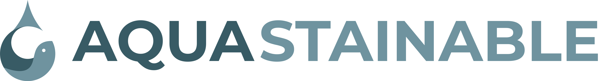
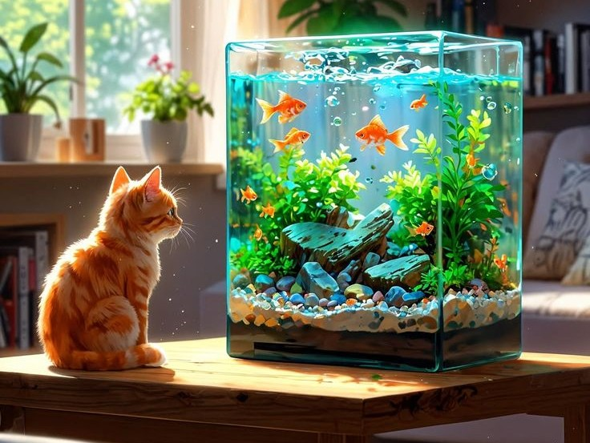

# Aquastainable

<p align="center">
   
</p>

<p align="center">
   A practical aquarium companion for healthier tanks, happier fish, and thriving aquatic plants.
</p>

## Table of Contents

- [Conceptualisation and Problem Statement](#conceptualisation-and-problem-statement)
- [Project Overview](#project-overview)
- [Target Audience](#target-audience)
- [Core Features and Scope](#core-features-and-scope)
- [MVP Features](#mvp-features)
- [Nice-to-Have Features](#nice-to-have-features)
- [User Flow](#user-flow)
- [Technology Stack](#technology-stack)
- [Project Structure](#project-structure)
- [Getting Started](#getting-started)
- [Backend Setup](#backend-setup)
- [Design Direction](#design-direction)
- [Future Development](#future-development)
- [Documentation](#documentation)

## Conceptualisation and Problem Statement

Aquastainable is a mobile aquarium-care application designed to make fishkeeping more understandable and sustainable for everyday aquarium owners.

Many new and intermediate fishkeepers struggle to remember water-test results, understand species requirements, identify signs of illness, and keep track of the fish and plants living in each tank. Aquarium information is often spread across search engines, social media posts, notes, and disconnected apps. This can lead to unhealthy water conditions, incompatible species, or preventable losses.

Aquastainable brings this information into one focused experience. Users can organise their tanks, record water conditions, view fish and plant care information, and ask an AI assistant for guidance when they need help.

## Project Overview

Aquastainable supports aquarium owners from account creation through everyday tank maintenance. Users can manage multiple aquariums, view the species in those tanks, inspect care requirements, record water tests, and ask the AI Assistant aquarium-related questions.

## Target Audience

- Beginner fishkeepers who need clear guidance for setting up and maintaining a tank.
- Intermediate aquarium owners who want a central record for multiple tanks.
- Fish and plant enthusiasts who want to monitor species, care needs, and tank health.
- Users who want quick, accessible help without searching through unreliable sources.

## Core Features and Scope

The feature scope is divided into an MVP that delivers the main aquarium-care workflow and nice-to-have features for future releases.

### MVP Features

| Image placeholder | Page | Feature and functions |
| --- | --- | --- |
|  | Home / Dashboard | View tanks, see key tank information, switch between aquariums, and add a new tank. |
|  | Tank Details | Review a tank overview, water conditions, care notes, fish, plants, and recent water-test information. |
|  | Fish Species | Browse fish in the user's tanks, view species information, and add a fish record. |
|  | Plant Species | Browse aquatic plants in the user's tanks, view plant care information, and add a plant record. |
|  | Water Test | Choose a tank and review its latest water-test summary and water-quality status. |
|  | AI Assistant | Ask aquarium-care questions, use suggested prompts, and attach media when more context is useful. |
|  | Sign In | Authenticate an existing user so personal tanks and records can be accessed. |
|  | Sign Up | Create an account with a username, email address, and password. |

### Nice-to-Have Features

| Image placeholder | Page or area | Feature and functions |
| --- | --- | --- |
|  | Water Test History | Compare past water tests over time and highlight changes that may need attention. |
|  | Reminders | Send reminders for water tests, feeding, cleaning, and routine maintenance. |
|  | Fish Compatibility | Check whether selected fish and plants are suitable for the same tank conditions. |
|  | Fish Health Logs | Track symptoms, photos, treatments, and recovery notes for individual fish. |
|  | Settings and Account | Manage profile details, preferences, notification settings, and account security. |
|  | Community Knowledge | Share setups and learn from trusted aquarium-care guides and other fishkeepers. |
|  | Personalised Recommendations | Suggest care actions based on tank size, species, water tests, and recorded history. |

> **Placeholder note:** Replace the image links above with final page screenshots or wireframes when they are available.

## User Flow

1. The user opens the app and moves from the splash screen to sign in or sign up.
2. After authentication, the user opens the dashboard and selects an existing tank or creates one.
3. The user reviews the tank overview and opens fish, plant, or water-test details as needed.
4. The user records new aquarium information and returns to the dashboard to monitor the tank.
5. When the user needs guidance, they open the AI Assistant and ask a question or provide an image.

## Technology Stack

- **Frontend:** React Native with Expo 54 and Expo Router.
- **Language:** TypeScript and JavaScript.
- **Navigation:** Expo Router with file-based routes and a gesture drawer.
- **Authentication and data:** Firebase Authentication, Firebase Admin, and a backend API.
- **Backend:** Node.js and Express.
- **Media:** Expo Image Picker and Cloudinary support in the backend.
- **UI:** React Native components, Expo Symbols, custom aquarium-care components, and Montserrat typography.

## Project Structure

```text
Aquastainable/
├── app/                  # Expo Router screens and route layouts
├── assets/               # Logos, aquarium images, fish, and plant images
├── components/           # Reusable UI and feature components
├── constants/            # Shared theme values
├── hooks/                # Shared React hooks and API hooks
├── data/                 # Local tank and species data
├── backend/              # Express API and Firebase Admin integration
├── documentation/        # Project pitch and supporting documentation
└── package.json          # Frontend scripts and dependencies
```

## Getting Started

### Prerequisites

- Node.js LTS
- npm
- Expo Go, an Android emulator, or an iOS simulator
- Firebase project credentials for authenticated and database-backed features

### Install and Run the Frontend

```bash
npm install
npx expo start
```

Useful commands:

```bash
npm run android
npm run ios
npm run web
npm run lint
```

## Backend Setup

The backend is in `backend` and runs as a separate Express service.

```bash
cd backend
npm install
npm start
```

Keep Firebase Admin credentials and other secrets in environment variables and do not commit them to the repository.

## Design Direction

Aquastainable uses a dark, water-inspired interface with cool blue accents, high-contrast text, aquarium imagery, rounded information cards, and gesture-based navigation. The visual language is calm and focused while keeping care information easy to scan.

## Future Development

The next development phase should focus on connecting every screen to persistent backend data, completing water-test history, adding care reminders, improving compatibility guidance, and validating the AI assistant with aquarium-specific responses.

## Documentation

The original project pitch is available in [documentation/Aquastainable project pitch.pdf](../documentation/Aquastainable%20project%20pitch.pdf).

This is an [Expo](https://expo.dev) project created with [`create-expo-app`](https://www.npmjs.com/package/create-expo-app).

## Get started

1. Install dependencies

   ```bash
   npm install
   ```

2. Start the app

   ```bash
   npx expo start
   ```

In the output, you'll find options to open the app in a

- [development build](https://docs.expo.dev/develop/development-builds/introduction/)
- [Android emulator](https://docs.expo.dev/workflow/android-studio-emulator/)
- [iOS simulator](https://docs.expo.dev/workflow/ios-simulator/)
- [Expo Go](https://expo.dev/go), a limited sandbox for trying out app development with Expo

You can start developing by editing the files inside the **app** directory. This project uses [file-based routing](https://docs.expo.dev/router/introduction).

## Get a fresh project

When you're ready, run:

```bash
npm run reset-project
```

This command will move the starter code to the **app-example** directory and create a blank **app** directory where you can start developing.

## Learn more

To learn more about developing your project with Expo, look at the following resources:

- [Expo documentation](https://docs.expo.dev/): Learn fundamentals, or go into advanced topics with our [guides](https://docs.expo.dev/guides).
- [Learn Expo tutorial](https://docs.expo.dev/tutorial/introduction/): Follow a step-by-step tutorial where you'll create a project that runs on Android, iOS, and the web.

## Join the community

Join our community of developers creating universal apps.

- [Expo on GitHub](https://github.com/expo/expo): View our open source platform and contribute.
- [Discord community](https://chat.expo.dev): Chat with Expo users and ask questions.
