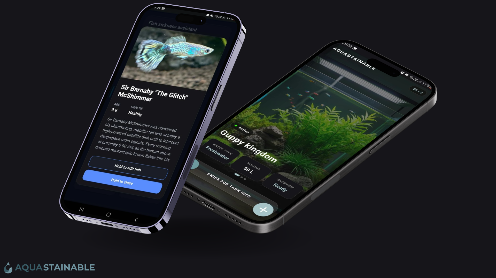
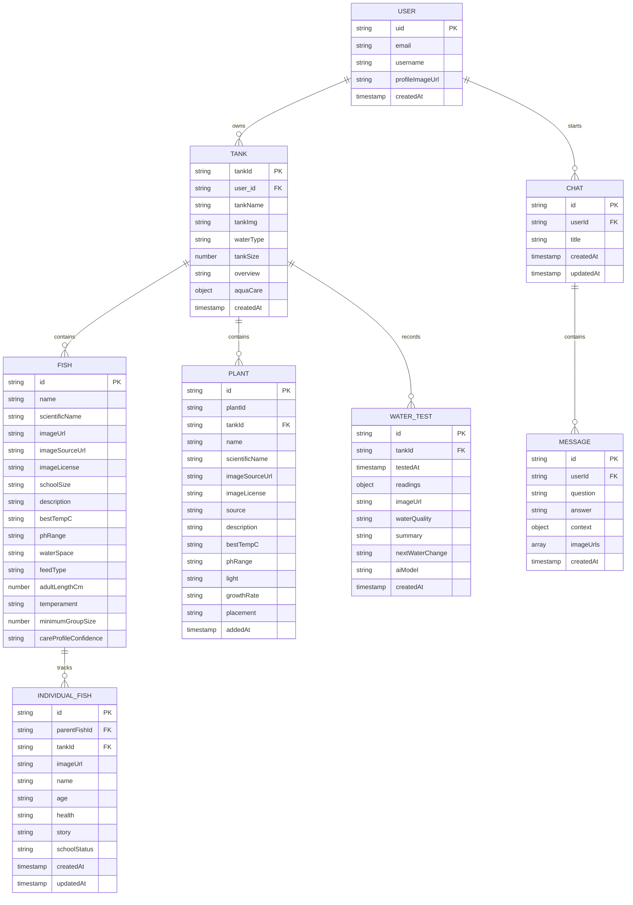

<p align="center">
  
</p>

<p align="center">A practical aquarium companion for healthier tanks, happier fish, and thriving aquatic plants.</p>

Aquastainable is a mobile freshwater aquarium-care app. It gives fishkeepers one place to manage tanks, record water tests, track fish and plants, and ask an aquarium-focused AI assistant for guidance.

<p align="center">
  
</p>

## Contents

- [Features](#features)
- [Application Flow](#application-flow)
- [Technology Stack](#technology-stack)
- [Project Structure](#project-structure)
- [Getting Started](#getting-started)
- [Entity Relationship Diagram](#entity-relationship-diagram)
- [API Reference](#api-reference)
- [How the API and LLM Work](#how-the-api-and-llm-work)
- [Data Model](#data-model)
- [Development Notes](#development-notes)
- [Documentation](#documentation)

## Features

### Accounts and Navigation

- Animated splash and loading screens.
- Email sign-up with username, password validation, and optional profile image support.
- Email sign-in and Firebase Auth session state.
- Gesture drawer navigation across the dashboard, species, water tests, and AI assistant.
- Hold-to-confirm actions for logout, editing, deleting, saving, and opening protected actions.

### Tanks and Dashboard

- View all tanks belonging to the signed-in user.
- Swipe between tanks on the dashboard.
- Create a tank with a name, freshwater type, size, and image from the camera or image library.
- Open a tank overview containing its image, dimensions, water conditions, fish, plants, and latest water test.
- Edit a tank name, size, or image.
- Delete a tank and its nested Firestore records.
- Generate and cache an AI-written tank overview from the tank's current records.

<p align="center">
  
</p>

### Fish

- Search the fish catalogue and add fish to a tank.
- Check fish compatibility before adding it, including tank size, stocking, water conditions, temperament, and school size.
- Suggest a safer tank when another user-owned tank is a better fit.
- View species profiles with origin, lifespan, temperature, pH, feeding, space, and schooling information.
- Generate missing care information with the LLM and store the enriched profile.
- Edit school size or remove a fish from a tank.
- Track individual fish with a name, age, health, story, school status, and photo.
- Add, edit, list, and delete individual fish records.
- Send a fish sickness or problem to the AI assistant with prefilled context and media.

<p align="center">
  
</p>

### Plants

- Search the plant catalogue and add plants to a tank.
- Check plant compatibility against tank conditions and existing livestock.
- View plant care information including light, growth rate, placement, temperature, and pH.
- Generate missing plant care information with the LLM.
- Remove saved plants from a tank.

<p align="center">
  
</p>

### Water Tests

- Select a tank and view its latest water-test status.
- Save dated pH, temperature, ammonia, nitrite, and other readings.
- Optionally attach a test image through Cloudinary.
- Receive an AI water-quality classification, summary, and suggested next water change.
- Browse previous tests in a history carousel.
- Treat ammonia, nitrite, and chlorine/chloramine as safety-critical conditions in the AI guidance.

### AI Assistant

- Ask freshwater aquarium questions in a persistent chat.
- Use modes for fish sickness and problems, water quality and care, tank planning and stocking, or general questions.
- Select tanks and species to provide relevant personal context.
- Attach an image or short video from the camera or gallery.
- Retry a question, start a new chat, open saved chat history, and delete chats.
- Use the assistant for species profiles, compatibility assessments, tank overviews, and water-test reviews as well as conversational help.

## Application Flow

1. The splash screen routes the user to sign in or sign up.
2. Successful authentication routes to the dashboard.
3. The dashboard loads the user's tanks from the Express API.
4. Users create or open a tank, then manage fish, plants, and water tests.
5. Fish and plant additions can be reviewed for compatibility before being saved.
6. The AI assistant receives the user's question, selected aquarium context, recent chat history, and optional uploaded media.

## Technology Stack

### Frameworks and runtimes

- React Native 0.81 with React 19.
- Expo SDK 54 and Expo Router 6 for the mobile application and file-based navigation.
- TypeScript 5.9 for frontend types and JavaScript for the Express backend.
- Node.js with Express 4 for the HTTP API.

### Frontend libraries

- `axios` for HTTP requests.
- `firebase` for Firebase Authentication and auth state listeners.
- `@react-navigation/native`, `@react-navigation/bottom-tabs`, and `@react-navigation/elements` for navigation foundations.
- `react-native-gesture-handler` and `react-native-reanimated` for gesture and animation support.
- `react-native-safe-area-context` and `react-native-screens` for native screen layout.
- `react-native-svg` for animated water, ripple, and interface graphics.
- `@expo/vector-icons` and `expo-symbols` for icons.
- `@expo-google-fonts/montserrat` for typography.
- `expo-image`, `expo-image-picker`, and `expo-camera` for aquarium images and AI attachments.
- `expo-haptics`, `expo-splash-screen`, `expo-status-bar`, `expo-linking`, `expo-constants`, `expo-system-ui`, and `expo-web-browser` for device and Expo integration.

### Backend libraries and services

- `express`, `cors`, `dotenv`, and `axios` for the API server and configuration.
- `firebase-admin` for Firestore and server-side Firebase user management.
- `cloudinary` for tank, water-test, AI-question, and individual-fish image uploads.
- Groq's OpenAI-compatible Chat Completions API for LLM responses.

## Project Structure

```text
Aquastainable/
├── Aquastainable/
│   ├── app/                 # Expo Router screens, layouts, hooks, and local data
│   ├── assets/              # Logos, aquarium, fish, plant, and icon assets
│   ├── components/          # Reusable UI and feature components
│   ├── constants/           # Theme constants
│   ├── hooks/               # Shared Expo/theme hooks
│   ├── firebase.ts          # Client Firebase configuration
│   └── package.json         # Frontend scripts and dependencies
├── backend/
│   ├── ai/                  # Prompts, Groq provider, and AI routes
│   ├── fish/                # Fish catalogue and tank-fish routes
│   ├── plant/               # Plant catalogue and tank-plant routes
│   ├── index.js             # Express server, tank, auth, and water-test routes
│   └── package.json         # Backend scripts and dependencies
├── documentation/           # Project presentation and supporting documents
└── README.md
```

## Getting Started

### Prerequisites

- Node.js LTS and npm.
- Expo Go, an Android emulator, an iOS simulator, or a web browser.
- A Firebase project with Authentication and Firestore enabled.
- A Firebase web configuration for the frontend.

### Run the frontend

```bash
cd Aquastainable
npm install
npx expo start
```

Useful scripts:

```bash
npm run android
npm run ios
npm run web
npm run lint
```

The backend is hosted on Render at `https://aquastainable.onrender.com` and does not need to be installed or started locally. The frontend is already configured to use this deployed API.

## Entity Relationship Diagram

The application stores user and aquarium data in Firestore. Aquarium records are nested under their owning tank, while assistant chats are nested under the user.



## How the API and LLM Work

1. The Expo app uses hooks such as `useTankApi`, `useFishApi`, `usePlantApi`, `useWaterTestApi`, and `useAiApi` to call the Express API with Axios.
2. Express validates required fields, checks that a referenced tank belongs to the supplied user, and reads or writes Firestore through Firebase Admin.
3. For images, the backend uploads supported data URLs or remote URLs to Cloudinary and stores the resulting URL instead of sending raw media into Firestore.
4. AI routes call `backend/ai/service.js`, which selects the Groq provider and combines a shared freshwater-aquarium safety prompt with a task-specific prompt.
5. Conversational requests include a maximum of the latest 20 history messages, selected tanks and species, the active assistant mode, and any uploaded image URLs. Image and base64 fields are removed from structured context before prompting.
6. Structured tasks request JSON from the LLM, parse and normalize the result, and save care profiles, compatibility assessments, or water-test reviews where appropriate.
7. Tank overviews use a data fingerprint. If the tank records have not changed, the cached overview is returned without another LLM request.
8. The assistant is restricted to freshwater aquarium topics and is instructed to prioritize animal welfare, avoid unsafe stocking, and treat detectable ammonia or nitrite as dangerous. AI output is educational and does not replace a qualified aquatic professional.

## Data Model

Firestore stores users in `users/{userId}` and tanks in `tanks/{tankId}`. A tank owns nested collections for `fish`, `plants`, `waterTests`, and individual fish records under `fish/{fishDocId}/individualFish`. Assistant conversations are stored under `users/{userId}/Chats/{chatId}/messages`.

## Development Notes

- The client Firebase configuration is public web configuration, but Firestore operations should remain behind the backend API.
- Add Firebase ID-token verification middleware before treating the current `userId` ownership pattern as production authentication.
- When adding a route, update both the relevant frontend hook and this API reference.
- Run `npm run lint` from `Aquastainable/` after frontend changes.

## Documentation

The project presentation is available in [documentation/Aquastainable project pitch.pdf](documentation/Aquastainable%20project%20pitch.pdf).


The frontend was created with [Expo](https://expo.dev) and [create-expo-app](https://www.npmjs.com/package/create-expo-app).
